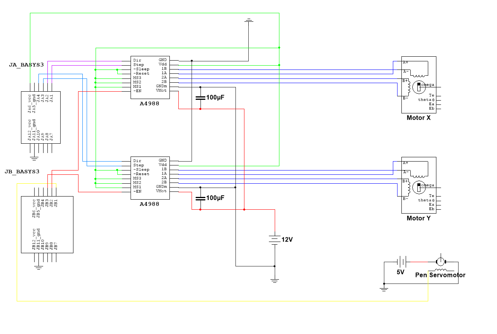
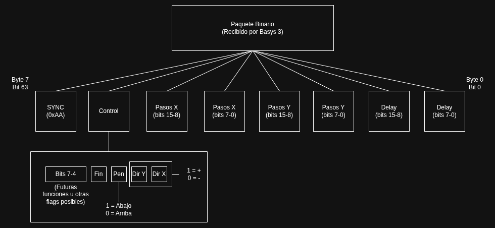

# FBP: FPGA Based Plotter
### Proyecto Final de Asignatura | PHR

Este repositorio recogerá todo el código y recursos utilizados para el desarrollo del proyecto final de la asignatura de Programación de Hardware Reconfigurable.

FBP se trata de una máquina CNC tipo plotter, capaz de dibujar sobre un plano utilizando un lápiz o bolígrafo, siendo útil su aplicación en varios campos de ingeniería. Este proyecto es un acercamiento a una máquina final, en la que se dibujarán imágenes procesadas a G-code interpretadas por una FPGA.

En el proyecto se encuentran tanto los ficheros en relación con el procesado de G-Code, como el código VHDL correspondiente al proyecto. La conversión de imagen a G-code se ha realizado utilizando la herramienta [image2gcode](https://github.com/LittleSurvival/image2gcode).

La memoria descriptiva del proyecto puede encontrarse en la carpeta `docs`, en formato PDF.

El **circuito** del proyecto queda definido bajo el siguiente esquema (puede haber simbología no coincidente):

Los paquetes binarios recibidos por la Basys 3 tienen la siguiente estructura:

